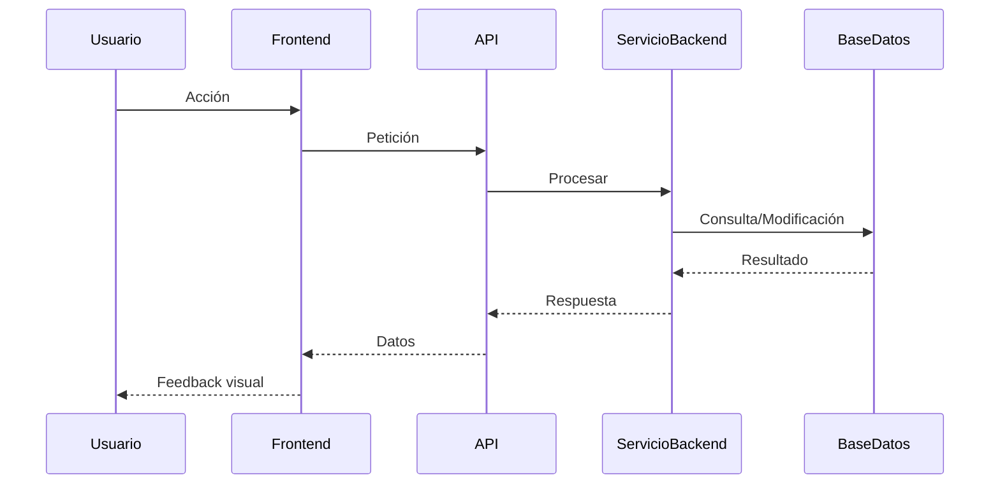
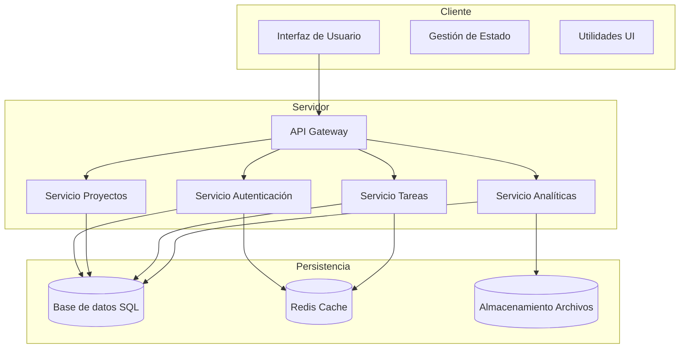
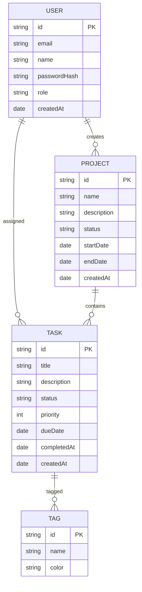
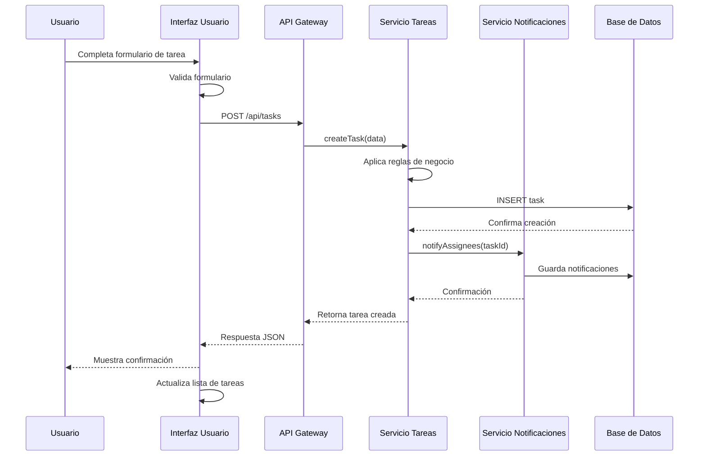
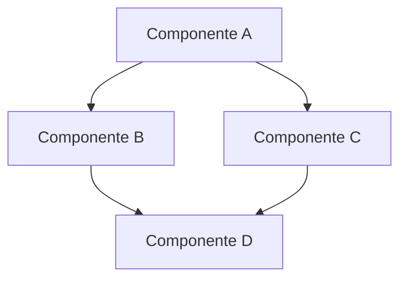
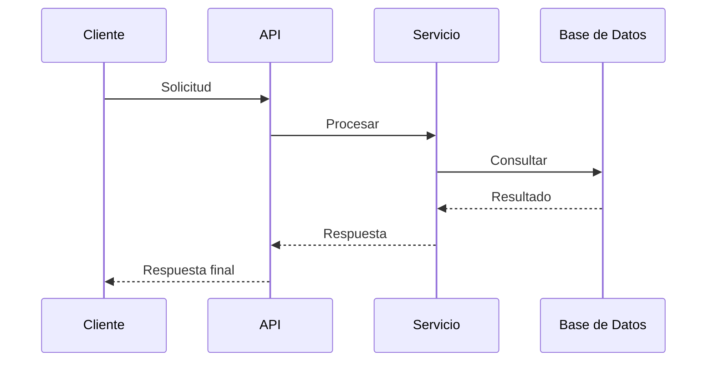
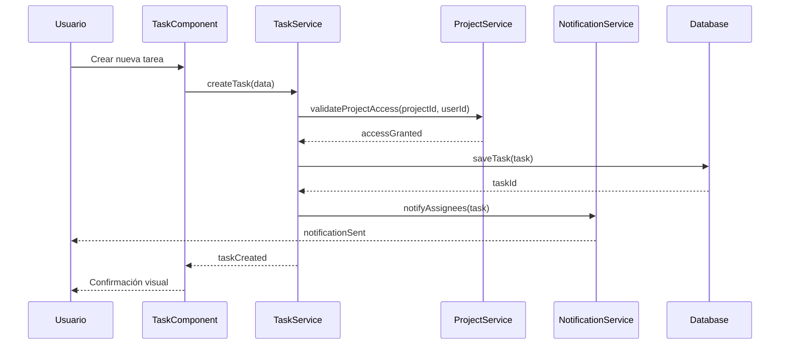

# 5. Flujo de Trabajo Completo

## 5.1. Planificación de Proyectos

La planificación efectiva es la base de cualquier proyecto exitoso. En el desarrollo con IA, esta fase adquiere aún más importancia ya que establece el marco de referencia que guiará tanto a los desarrolladores humanos como a los asistentes de IA.

### Uso del prompt Plan_Diseño

El prompt `Plan_Diseño` está diseñado para crear un documento detallado que defina la arquitectura completa del sistema, incluyendo tanto el frontend (interfaz de usuario) como el backend (arquitectura del servidor, modelos de datos y lógica de negocio). Este documento (`DESIGN_PLAN.md`) servirá como referencia principal para el desarrollo integral del sistema.

#### Proceso de ejecución:

1. **Preparación**:
   - Recopila los requisitos funcionales y técnicos del proyecto
   - Identifica a los usuarios finales y stakeholders
   - Define los principios arquitectónicos y de diseño que guiarán el desarrollo
   - Evalúa las tecnologías potenciales para frontend y backend

2. **Ejecución del prompt**:
   - Proporciona los requisitos recopilados al prompt Plan_Diseño
   - Asegúrate de personalizar las secciones marcadas con **(EDITAR)**
   - Proporciona detalles suficientes tanto para aspectos de UI/UX como para la arquitectura técnica

3. **Revisión y refinamiento**:
   - Analiza el documento generado
   - Asegúrate de que todas las funcionalidades clave estén representadas
   - Verifica que la arquitectura backend sea coherente con los requisitos de frontend
   - Refina aquellas áreas que requieran más detalle o claridad

#### Elementos clave a incluir:

El prompt generará un plan que contendrá:

- **Resumen del proyecto**: Propósito, usuarios finales y stakeholders
- **Arquitectura general**: Diagrama de arquitectura, componentes principales y patrones arquitectónicos
- **Diseño Frontend**:
  - Tipo de interfaz (web, móvil, etc.)
  - Principios de diseño UI/UX
  - Estructura de pantallas y componentes
  - Consideraciones técnicas (framework, gestión de estado, etc.)
- **Diseño Backend**:
  - Arquitectura del servidor
  - Modelo de datos
  - API y comunicación
  - Lógica de negocio
  - Consideraciones técnicas (framework, testing, etc.)
- **Flujos completos**: Diagramas de secuencia que muestran interacciones frontend-backend
- **Consideraciones transversales**: Seguridad, escalabilidad, accesibilidad, etc.
- **Ejemplos ilustrativos**: Maquetas, ejemplos de API, esquemas de datos, etc.

### Creación de DESIGN_PLAN.md

El documento `DESIGN_PLAN.md` no es solo una especificación técnica, sino una guía comprensiva que comunica cómo funcionará el sistema completo, desde la interfaz de usuario hasta la persistencia de datos.

#### Estructura recomendada:

```markdown
# Plan de Diseño de Proyecto - [Nombre del Proyecto]

## 1. Resumen del Proyecto
[Descripción del propósito, usuarios finales, stakeholders y objetivos principales]

## 2. Arquitectura General
[Diagrama de arquitectura usando Mermaid]

[Descripción de componentes principales y patrones arquitectónicos]

[Tecnologías principales para frontend y backend]

## 3. Diseño Frontend

### 3.1 Tipo de interfaz
[Web/Móvil/Desktop con justificación]

### 3.2 Principios de diseño UI/UX
[Lista de principios con breves explicaciones]

### 3.3 Estructura de pantallas
[Descripción de navegación y pantallas principales]

### 3.4 Consideraciones técnicas frontend
[Framework, gestión de estado, enrutamiento, etc.]

## 4. Diseño Backend

### 4.1 Arquitectura del servidor
[Patrón arquitectónico y descripción de capas]

### 4.2 Modelo de datos
[Diagrama de entidades usando Mermaid]

[Descripción de entidades y relaciones principales]

### 4.3 API y comunicación
[Estructura de endpoints/recursos]

[Autenticación y manejo de errores]

### 4.4 Lógica de negocio
[Servicios principales y flujos de trabajo]

## 5. Flujos de usuario completos
### Flujo 1: [Nombre]

[Descripción detallada del flujo]

## 6. Consideraciones transversales
[Seguridad, escalabilidad, accesibilidad, etc.]

## 7. Ejemplos ilustrativos
[Maquetas, ejemplos de API, esquemas de datos, etc.]

## 8. AI-Hints para el diseño
[Comentarios específicos para los modelos de IA]
```

#### Consejos para un DESIGN_PLAN.md efectivo:

1. **Sé específico**: Evita generalidades y proporciona detalles concretos.
2. **Equilibra frontend y backend**: Da igual importancia a ambos aspectos del sistema.
3. **Usa diagramas**: Aprovecha Mermaid para arquitectura, flujos y modelos de datos.
4. **Enfócate en conexiones**: Explica claramente cómo se relacionan frontend y backend.
5. **Incluye ejemplos completos**: Proporciona ejemplos que muestren tanto UI como API y datos.
6. **Considera flujos end-to-end**: Documenta flujos completos desde usuario hasta base de datos.

#### Integración con IA:

Este documento sirve como referencia vital para la IA, permitiendo:
- Generar código que se adhiera a la arquitectura definida
- Mantener consistencia entre frontend y backend
- Comprender el contexto completo del sistema
- Detectar inconsistencias o problemas potenciales
- Sugerir mejoras alineadas con la arquitectura global

### Ejemplos prácticos

**Ejemplo de arquitectura general:**
```markdown
## 2. Arquitectura General



TaskFlow implementará una arquitectura cliente-servidor con un frontend SPA y un backend basado en servicios. El frontend utilizará React con una arquitectura basada en componentes y hooks, mientras que el backend seguirá un diseño modular con servicios específicos para cada dominio principal.

### Tecnologías principales

**Frontend:**
- React 18
- TypeScript
- Redux Toolkit para gestión de estado
- React Router para navegación
- Material-UI para componentes de interfaz

**Backend:**
- Node.js con Express
- TypeScript
- MongoDB con Mongoose
- JWT para autenticación
- Redis para caché
```

**Ejemplo de diseño frontend:**
```markdown
## 3. Diseño Frontend

### 3.1 Tipo de interfaz

TaskFlow implementará una interfaz web progresiva (PWA) compatible con escritorio y dispositivos móviles, con diseño responsivo y capacidades offline.

### 3.2 Principios de diseño UI/UX

- **Consistencia**: Elementos visuales uniformes en toda la aplicación.
- **Feedback inmediato**: Respuesta visual para cada acción del usuario.
- **Eficiencia**: Minimizar pasos para tareas frecuentes.
- **Jerarquía visual**: Organización intuitiva de información por importancia.
- **Accesibilidad**: Conformidad con WCAG 2.1 nivel AA.

### 3.3 Estructura de pantallas

#### Dashboard principal
- Barra superior: Logo, búsqueda global, notificaciones, perfil usuario
- Panel lateral: Navegación principal, filtros rápidos, modo oscuro toggle
- Área central: Widgets configurables con data cards
- Acciones principales: Botón "+" flotante para creación rápida

#### Detalle de Proyecto
- Cabecera: Título, estado, progreso, fechas clave
- Pestañas: Resumen, Tareas, Miembros, Documentos, Configuración
- Panel de actividad: Timeline de eventos recientes
- Panel lateral: Metadata y acciones rápidas

### 3.4 Consideraciones técnicas frontend

- **Framework**: React con TypeScript para tipo seguro
- **Gestión de estado**: Redux Toolkit para estado global, Context API para estado local
- **Enrutamiento**: React Router v6 con rutas protegidas
- **Formularios**: React Hook Form con validación Yup
- **Optimización**: Code splitting por rutas, lazy loading para componentes pesados
```

**Ejemplo de diseño backend:**
```markdown
## 4. Diseño Backend

### 4.1 Arquitectura del servidor

TaskFlow implementará una arquitectura modular siguiendo principios Clean Architecture:

- **Capa de presentación**: Controladores API Express
- **Capa de aplicación**: Servicios que implementan lógica de negocio
- **Capa de dominio**: Entidades y reglas de negocio
- **Capa de infraestructura**: Repositorios, adaptadores externos

### 4.2 Modelo de datos



### 4.3 API y comunicación

#### Autenticación
- `POST /api/auth/register`: Registro de usuarios
- `POST /api/auth/login`: Inicio de sesión con JWT
- `POST /api/auth/refresh`: Renovación de token

#### Proyectos
- `GET /api/projects`: Listado paginado de proyectos
- `POST /api/projects`: Creación de nuevo proyecto
- `GET /api/projects/:id`: Detalle de proyecto específico
- `PUT /api/projects/:id`: Actualización completa de proyecto

#### Tareas
- `GET /api/tasks`: Listado de tareas con filtros
- `POST /api/tasks`: Creación de tarea
- `PATCH /api/tasks/:id/status`: Cambio de estado de tarea

#### Formato de respuestas

Todas las respuestas seguirán un formato estándar:

```json
{
  "success": true,
  "data": { /* Datos específicos */ },
  "meta": { /* Metadatos: paginación, etc. */ }
}
```

### 4.4 Lógica de negocio

#### Servicios principales:
- **AuthService**: Gestión de autenticación y permisos
- **ProjectService**: CRUD y reglas de negocio para proyectos
- **TaskService**: Gestión de tareas, asignaciones y estados
- **NotificationService**: Envío de notificaciones a usuarios
- **AnalyticsService**: Cálculo de métricas y estadísticas
```

**Ejemplo de flujo completo:**
```markdown
## 5. Flujos de usuario completos

### Flujo: Creación y asignación de tarea



**Descripción detallada:**

1. El usuario accede al formulario de nueva tarea desde el dashboard o la vista de proyecto
2. Completa los campos: título, descripción, prioridad, fecha límite y asignados
3. La interfaz valida los datos en tiempo real (cliente)
4. Al enviar, la UI hace una petición POST al endpoint /api/tasks
5. El API Gateway recibe la petición y la redirige al servicio de tareas
6. El servicio aplica validaciones de negocio (permisos, restricciones)
7. Se crea el registro en la base de datos
8. Se notifica a los usuarios asignados
9. La respuesta regresa a través de la API hasta la UI
10. La interfaz muestra confirmación y actualiza la lista de tareas
```

## 5.2. Implementación Técnica

Una vez definida la interfaz, el siguiente paso es crear un plan detallado de implementación técnica que traduzca los requisitos funcionales en una estrategia clara de desarrollo.

### Uso del prompt Plan_Implantación

El prompt `Plan_Implantación` está diseñado para generar un documento técnico (`IMPLEMENTATION_PLAN.md`) que describe cómo se implementará el proyecto desde una perspectiva de arquitectura y desarrollo.

#### Proceso de ejecución:

1. **Preparación**:
   - Recopila información sobre requisitos técnicos
   - Define las restricciones tecnológicas (lenguajes, frameworks, etc.)
   - Identifica los principios arquitectónicos a seguir

2. **Ejecución del prompt**:
   - Proporciona los objetivos, requisitos y principios al prompt
   - Personaliza las secciones marcadas con **(EDITAR)**
   - Incluye información sobre tecnologías preferidas

3. **Revisión y refinamiento**:
   - Valida que la arquitectura propuesta sea viable
   - Confirma que cubre todos los requisitos funcionales
   - Ajusta detalles específicos según necesidades del proyecto

#### Elementos clave a incluir:

El prompt generará un plan que contendrá:

- **Resumen del Proyecto**: Descripción funcional y público objetivo
- **Tecnologías y herramientas**: Stack tecnológico completo
- **Principios y convenciones**: SOLID, DRY, estilos de codificación
- **Estructura de carpetas**: Organización lógica del proyecto
- **Componentes y módulos**: Responsabilidades e interacciones
- **Diseño de flujos**: Secuencias de operaciones para procesos clave
- **Plan de fases**: División lógica del trabajo
- **Pruebas y calidad**: Estrategia de testing
- **Despliegue**: Configuración de entornos

### Creación de IMPLEMENTATION_PLAN.md

El documento `IMPLEMENTATION_PLAN.md` proporciona un mapa detallado para la implementación técnica, sirviendo como guía tanto para desarrolladores humanos como para la IA.

#### Estructura recomendada:

```markdown
# Plan de Implementación - [Nombre del Proyecto]

## Resumen del Proyecto
[Descripción funcional, propósito y casos de uso principales]

## Tecnologías y herramientas
### Frontend
- [Tecnología 1]: [Versión] - [Justificación]
- [Tecnología 2]: [Versión] - [Justificación]
...

### Backend
- [Tecnología 1]: [Versión] - [Justificación]
- [Tecnología 2]: [Versión] - [Justificación]
...

### DevOps/Herramientas
- [Tecnología 1]: [Versión] - [Justificación]
- [Tecnología 2]: [Versión] - [Justificación]
...

## Principios y convenciones
[Descripción de principios arquitectónicos y convenciones de código]

## Estructura de carpetas/proyecto
```
[Estructura en ASCII o tabla]
```

[Descripción del propósito de cada directorio principal]

## Componentes y módulos principales
[Tabla o diagrama de componentes con responsabilidades]

### Diagrama de relaciones de componentes


## Diseño de flujos y responsabilidades
### Flujo 1: [Nombre]


[Descripción detallada del flujo]

## Plan de fases o sprints
[División en fases lógicas con dependencias y entregables]

## Pruebas y calidad
[Estrategia de testing, herramientas y métricas]

## Despliegue y entornos
[Configuración de entornos y proceso de despliegue]
```

#### Consejos para un IMPLEMENTATION_PLAN.md efectivo:

1. **Justifica decisiones**: Explica por qué se eligió cada tecnología o patrón.
2. **Usa diagramas**: Visualiza arquitectura y flujos para mayor claridad.
3. **Define límites claros**: Establece responsabilidades claras para cada componente.
4. **Especifica convenciones**: Detalla estándares de código y nomenclatura.
5. **Define secuencialmente**: Organiza el plan en fases lógicas que se construyen iterativamente.
6. **Documenta puntos de integración**: Especifica cómo se comunican los diferentes componentes.

#### Integración con IA:

Este documento permite a la IA:
- Generar código con la estructura correcta
- Seguir los patrones arquitectónicos definidos
- Comprender el contexto técnico completo
- Proponer soluciones alineadas con la arquitectura
- Detectar desviaciones respecto al plan

### Ejemplos prácticos

**Ejemplo de arquitectura y componentes:**
```markdown
## Componentes y módulos principales

### Frontend

| Componente | Responsabilidad | Dependencias |
|------------|-----------------|--------------|
| **AuthModule** | Gestión de autenticación y permisos | API Auth, StoreModule |
| **UserModule** | Administración de perfiles y preferencias | API Users, StoreModule |
| **ProjectModule** | Gestión completa de proyectos | API Projects, StoreModule |
| **DashboardModule** | Visualización de datos y métricas | API Analytics, ChartComponents |
| **SharedModule** | Componentes y utilidades comunes | - |

### Backend

| Componente | Responsabilidad | Dependencias |
|------------|-----------------|--------------|
| **AuthService** | Autenticación, autorización y tokens | UserRepository, JWTService |
| **UserService** | Gestión de usuarios y perfiles | UserRepository, StorageService |
| **ProjectService** | Lógica de negocio para proyectos | ProjectRepository, UserService |
| **NotificationService** | Gestión y envío de notificaciones | EmailService, PushService |
| **AnalyticsService** | Recopilación y procesamiento de métricas | TimeSeriesDB, ProjectService |
```

**Ejemplo de flujo de operaciones:**
```markdown
## Diseño de flujos y responsabilidades

### Flujo: Creación y asignación de tarea



1. El usuario completa el formulario de nueva tarea y lo envía
2. El componente valida los datos del formulario localmente
3. Se envía la solicitud al TaskService en el backend
4. Se verifica que el usuario tenga permisos en el proyecto
5. Se guarda la tarea en la base de datos
6. Se notifica a los usuarios asignados
7. Se devuelve confirmación al frontend
8. Se muestra confirmación visual y se actualiza la lista de tareas

**Consideraciones especiales:**
- Se implementa validación tanto en cliente como en servidor
- Las notificaciones son asíncronas para no bloquear el flujo principal
- Los errores en cualquier paso deben revertir la operación completa
```

## 5.3. Lista de Tareas Concretas

Después de establecer los planes de interfaz e implementación, el siguiente paso es crear una lista detallada de tareas que guíen el desarrollo día a día.

### Uso del prompt TODO

El prompt `TODO` está diseñado para generar un archivo `TODO.md` con tareas específicas, accionables y organizadas lógicamente, basadas en los documentos de planificación previos.

#### Proceso de ejecución:

1. **Preparación**:
   - Asegúrate de tener listos `DESIGN_PLAN.md` e `IMPLEMENTATION_PLAN.md`
   - Identifica prioridades y dependencias entre tareas
   - Define el nivel de granularidad deseado para las tareas

2. **Ejecución del prompt**:
   - Proporciona los documentos de planificación al prompt TODO
   - Personaliza las instrucciones específicas si es necesario
   - Indica si hay restricciones particulares (tiempo, recursos, etc.)

3. **Revisión y refinamiento**:
   - Verifica que las tareas sean lo suficientemente específicas
   - Confirma que el orden propuesto es lógico y respeta dependencias
   - Ajusta prioridades según necesidades del proyecto

#### Elementos clave a incluir:

El prompt generará una lista que contendrá:

- **Tareas específicas y atómicas**: Acciones concretas y verificables
- **Agrupación lógica**: Organización por componentes o funcionalidades
- **Secuencia clara**: Orden que respeta dependencias técnicas
- **Formato de checklist**: Facilita seguimiento del progreso
- **Balance entre detalle y mantenibilidad**: Suficiente detalle sin excesiva complejidad

### Creación de TODO.md

El documento `TODO.md` sirve como hoja de ruta detallada para el desarrollo, proporcionando una secuencia clara de pasos a seguir.

#### Estructura recomendada:

```markdown
# Lista de Tareas - [Nombre del Proyecto]

## 1. [Fase/Componente 1]

### 1.1 [Subfase/Subcomponente 1.1]
- [ ] Tarea 1.1.1: [Descripción específica]
- [ ] Tarea 1.1.2: [Descripción específica]
- [ ] Tarea 1.1.3: [Descripción específica]

### 1.2 [Subfase/Subcomponente 1.2]
- [ ] Tarea 1.2.1: [Descripción específica]
- [ ] Tarea 1.2.2: [Descripción específica]

## 2. [Fase/Componente 2]

### 2.1 [Subfase/Subcomponente 2.1]
- [ ] Tarea 2.1.1: [Descripción específica]
- [ ] Tarea 2.1.2: [Descripción específica]
...
```

#### Consejos para un TODO.md efectivo:

1. **Granularidad adecuada**: Tareas que puedan completarse en unas pocas horas
2. **Especificidad**: Descripciones claras que indiquen exactamente qué hacer
3. **Secuencia lógica**: Ordenar tareas respetando dependencias técnicas
4. **Incluir verificación**: Añadir tareas de prueba después de cada implementación
5. **Actualizar regularmente**: Revisar y ajustar la lista a medida que avanza el proyecto
6. **Balancear completitud y flexibilidad**: Suficiente detalle sin sobreplanificar

#### Integración con IA:

Este documento ayuda a la IA a:
- Comprender el contexto inmediato de desarrollo
- Generar código que se alinee con la tarea actual
- Reconocer dependencias entre componentes
- Sugerir pruebas apropiadas para cada implementación

### Ejemplos prácticos

**Ejemplo de tareas para backend:**
```markdown
## 2. Implementación de Autenticación

### 2.1 Backend - Modelos y servicios
- [ ] Crear modelo de Usuario con Mongoose
  ```javascript
  // Estructura esperada:
  const UserSchema = new Schema({
    email: { type: String, required: true, unique: true },
    password: { type: String, required: true },
    name: String,
    role: { type: String, enum: ['user', 'admin'], default: 'user' },
    createdAt: { type: Date, default: Date.now }
  });
  ```
- [ ] Implementar servicio de hash y verificación de contraseñas
- [ ] Desarrollar servicio de generación de JWT
- [ ] Crear middleware de autenticación
- [ ] Añadir AI-Hints para el servicio de autenticación

### 2.2 Backend - Endpoints API
- [ ] Implementar endpoint de registro (POST /api/auth/register)
- [ ] Implementar endpoint de login (POST /api/auth/login)
- [ ] Implementar endpoint de refresh token (POST /api/auth/refresh)
- [ ] Crear pruebas para los endpoints de autenticación
  - [ ] Prueba: registro exitoso
  - [ ] Prueba: registro con email duplicado
  - [ ] Prueba: login exitoso
  - [ ] Prueba: login con credenciales incorrectas
```

**Ejemplo de tareas para frontend:**
```markdown
## 3. Implementación de Dashboard

### 3.1 Componentes principales
- [ ] Crear estructura base del Dashboard
  - Barra lateral
  - Área de contenido principal
  - Barra superior
- [ ] Implementar navegación principal
  - [ ] Lista de secciones disponibles
  - [ ] Indicador de sección activa
  - [ ] Manejo de permisos por rol
- [ ] Desarrollar componente de perfil resumido
  - [ ] Avatar de usuario
  - [ ] Menú desplegable con opciones

### 3.2 Widgets del Dashboard
- [ ] Implementar widget de tareas pendientes
  - [ ] Conexión con API de tareas
  - [ ] Vista de lista con acciones rápidas
  - [ ] Filtrado básico
- [ ] Implementar widget de actividad reciente
  - [ ] Conexión con API de actividad
  - [ ] Formato de timeline con acciones
  - [ ] Paginación "cargar más"
- [ ] Crear widget de métricas principales
  - [ ] Gráficos de progreso
  - [ ] Indicadores numéricos
  - [ ] Tooltips informativos
```

## 5.4. Ejecución del Desarrollo

Con una planificación completa, es momento de implementar el proyecto siguiendo una metodología paso a paso que garantice calidad y coherencia.

### Uso del prompt Ejecución_desarrollo

El prompt `Ejecución_desarrollo` está diseñado para guiar la implementación de tareas específicas del proyecto, siguiendo un enfoque estructurado y metódico.

#### Proceso de ejecución:

1. **Preparación**:
   - Identifica la tarea específica a implementar (ej: `{{TASK}} = 11.2`)
   - Revisa la documentación relacionada con la tarea
   - Verifica las dependencias y requisitos previos

2. **Ejecución del prompt**:
   - Proporciona el identificador de tarea al prompt
   - Asegúrate de que hay suficiente contexto sobre la tarea
   - Define expectativas claras para el resultado

3. **Seguimiento del proceso**:
   - El prompt guiará a través del análisis, planificación y ejecución
   - Se dividirá la tarea en subtareas manejables
   - Se implementará cada subtarea secuencialmente
   - Se realizarán pruebas y documentación

#### Elementos clave del proceso:

El enfoque guiado por el prompt incluye:

1. **Análisis Inicial**:
   - Comprender el contexto del proyecto
   - Identificar requisitos específicos
   - Evaluar dependencias y restricciones

2. **Planificación de Subtareas**:
   - Dividir la tarea en pasos lógicos y secuenciales
   - Establecer prioridades
   - Definir criterios de éxito para cada subtarea

3. **Ejecución Paso a Paso**:
   - Implementar cada subtarea
   - Añadir AI-Hints estratégicos
   - Probar cada componente implementado
   - Documentar el código y funcionalidades

4. **Integración**:
   - Asegurar que las partes implementadas funcionan en conjunto
   - Validar contra requisitos originales
   - Actualizar documentación general

### Metodología de desarrollo con IA

El desarrollo eficiente con Cursor IDE sigue un patrón que maximiza las capacidades de la IA mientras mantiene un alto estándar de calidad.

#### Ciclo de desarrollo:

1. **Definición clara**:
   - Especificar exactamente qué se va a implementar
   - Proporcionar contexto suficiente
   - Establecer criterios de éxito

2. **Generación asistida**:
   - Usar Cursor para generar la implementación inicial
   - Proporcionar retroalimentación y refinar
   - Añadir AI-Hints para futuras interacciones

3. **Validación**:
   - Revisar el código generado
   - Ejecutar pruebas
   - Verificar contra requisitos

4. **Refinamiento**:
   - Optimizar rendimiento si es necesario
   - Mejorar legibilidad y mantenibilidad
   - Completar documentación

5. **Integración**:
   - Probar con otros componentes
   - Resolver conflictos o problemas de integración
   - Actualizar documentación del proyecto

#### Prácticas recomendadas:

1. **Comunicación efectiva con la IA**:
   - Ser específico en las instrucciones
   - Proporcionar ejemplos cuando sea posible
   - Darle feedback claro

2. **AI-Hints estratégicos**:
   - Añadir en puntos clave del código
   - Incluir información no obvia del contexto
   - Actualizar cuando cambie la lógica

3. **Iteraciones pequeñas**:
   - Preferir múltiples generaciones pequeñas
   - Validar frecuentemente
   - Refinar progresivamente

4. **Revisión humana**:
   - Revisar siempre el código generado
   - Verificar especialmente seguridad y rendimiento
   - Asegurar adherencia a estándares del proyecto

### Ejemplos prácticos

**Ejemplo de implementación de componente**:

```markdown
## Implementación de AuthService

### Análisis
La tarea requiere crear un servicio de autenticación que maneje login, registro y gestión de tokens JWT.

Dependencias identificadas:
- Modelo de Usuario
- Librería de JWT
- Configuración de la aplicación

### Subtareas

#### 1. Crear estructura base del servicio
```typescript
// src/services/auth.service.ts

// AI-Hint Architecture: [Service Layer] [Implementa lógica de autenticación y autorización] [Sigue patrón singleton]

// AI-Hint Component: [AuthService] [Gestiona autenticación, tokens JWT y permisos] [Central para seguridad de la app]

import { User, IUser } from '../models/user.model';
import jwt from 'jsonwebtoken';
import bcrypt from 'bcrypt';
import config from '../config';

export class AuthService {
  private static instance: AuthService;
  
  private constructor() {}
  
  public static getInstance(): AuthService {
    if (!AuthService.instance) {
      AuthService.instance = new AuthService();
    }
    return AuthService.instance;
  }
  
  // Métodos a implementar:
  // - registerUser
  // - loginUser
  // - verifyToken
  // - refreshToken
  // - hashPassword
  // - comparePassword
}
```

#### 2. Implementar métodos de hash y comparación
```typescript
// Añadir a AuthService:

// AI-Hint Security: [Password hashing] [Usa bcrypt con salt rounds configurable] [Nunca almacena contraseñas en texto plano]
public async hashPassword(password: string): Promise<string> {
  const saltRounds = config.security.saltRounds || 10;
  return bcrypt.hash(password, saltRounds);
}

public async comparePassword(password: string, hash: string): Promise<boolean> {
  return bcrypt.compare(password, hash);
}
```

#### 3. Implementar registro de usuario
```typescript
// Añadir a AuthService:

// AI-Hint Flow: [Registro de usuario] [Validar → Hash password → Crear usuario → Generar token] [Evita duplicados por email]
public async registerUser(userData: Partial<IUser>): Promise<{user: Partial<IUser>, token: string}> {
  // Verificar si el usuario ya existe
  const existingUser = await User.findOne({ email: userData.email });
  if (existingUser) {
    throw new Error('Email already registered');
  }
  
  // Hash del password
  const hashedPassword = await this.hashPassword(userData.password);
  
  // Crear nuevo usuario
  const user = new User({
    ...userData,
    password: hashedPassword,
    role: userData.role || 'user'
  });
  
  await user.save();
  
  // Generar token
  const token = this.generateToken(user);
  
  // Devolver usuario (sin password) y token
  const userResponse = user.toObject();
  delete userResponse.password;
  
  return { user: userResponse, token };
}
```

#### 4. Pruebas para registro de usuario
```typescript
// tests/auth.service.test.ts

import { AuthService } from '../src/services/auth.service';
import { User } from '../src/models/user.model';
import mongoose from 'mongoose';

// Mock de dependencias
jest.mock('../src/models/user.model');

describe('AuthService - registerUser', () => {
  let authService: AuthService;
  
  beforeEach(() => {
    authService = AuthService.getInstance();
    jest.clearAllMocks();
  });
  
  it('should register a new user successfully', async () => {
    // Arrange
    const userData = {
      name: 'Test User',
      email: 'test@example.com',
      password: 'securepassword'
    };
    
    (User.findOne as jest.Mock).mockResolvedValue(null);
    (User.prototype.save as jest.Mock).mockResolvedValue(userData);
    
    // Act
    const result = await authService.registerUser(userData);
    
    // Assert
    expect(result).toHaveProperty('user');
    expect(result).toHaveProperty('token');
    expect(result.user).not.toHaveProperty('password');
    expect(User.prototype.save).toHaveBeenCalled();
  });
  
  it('should throw error if email already exists', async () => {
    // Arrange
    const userData = {
      name: 'Test User',
      email: 'existing@example.com',
      password: 'securepassword'
    };
    
    (User.findOne as jest.Mock).mockResolvedValue({ email: 'existing@example.com' });
    
    // Act & Assert
    await expect(authService.registerUser(userData)).rejects.toThrow('Email already registered');
  });
});
```

#### 5. Documentación de API
```markdown
# Auth API

## Register User

**Endpoint:** `POST /api/auth/register`

**Description:** Registers a new user in the system

**Request Body:**
```json
{
  "name": "User Name",
  "email": "user@example.com",
  "password": "securepassword"
}
```

**Response (200 OK):**
```json
{
  "success": true,
  "data": {
    "user": {
      "id": "60d21b4667d0d8992e610c85",
      "name": "User Name",
      "email": "user@example.com",
      "role": "user",
      "createdAt": "2023-06-22T17:32:28Z"
    },
    "token": "eyJhbGciOiJIUzI1NiIsInR5cCI6IkpXVCJ9..."
  }
}
```

**Error Responses:**

- **409 Conflict:** Email already registered
- **400 Bad Request:** Invalid input data
```