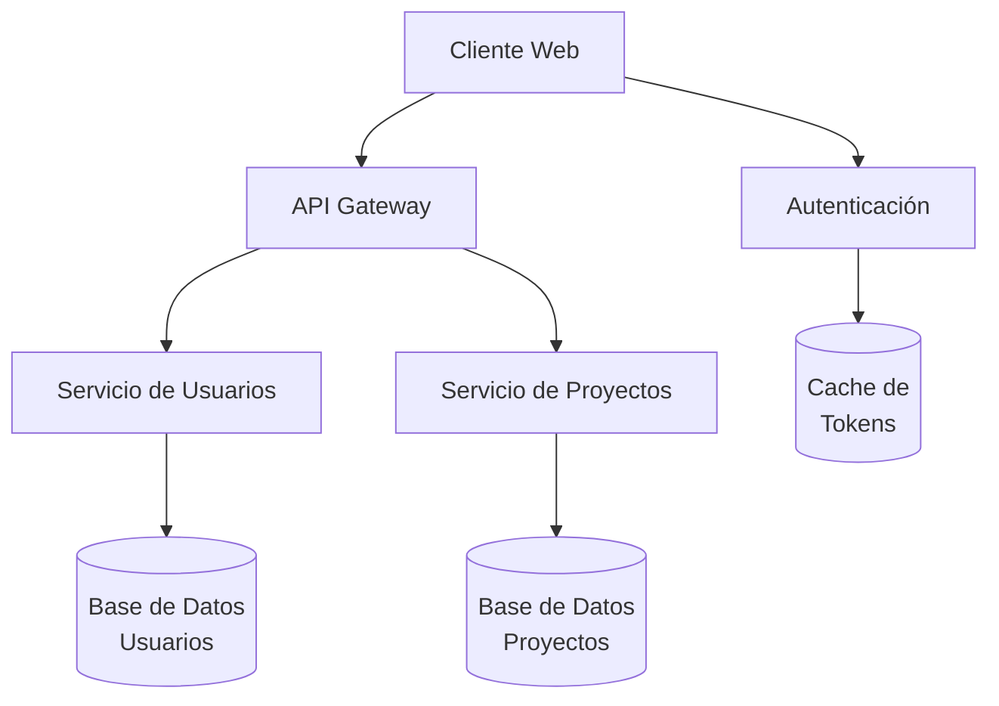
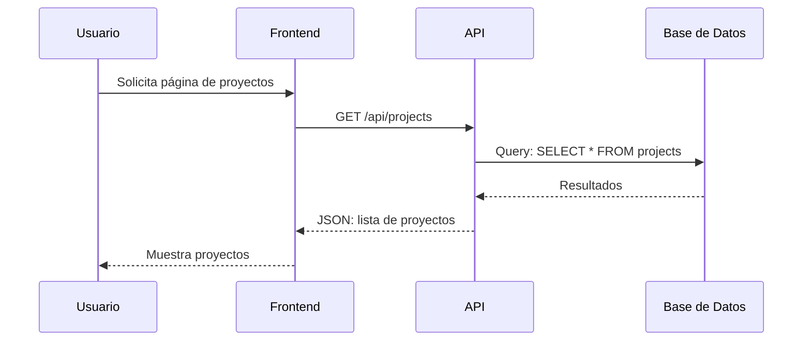
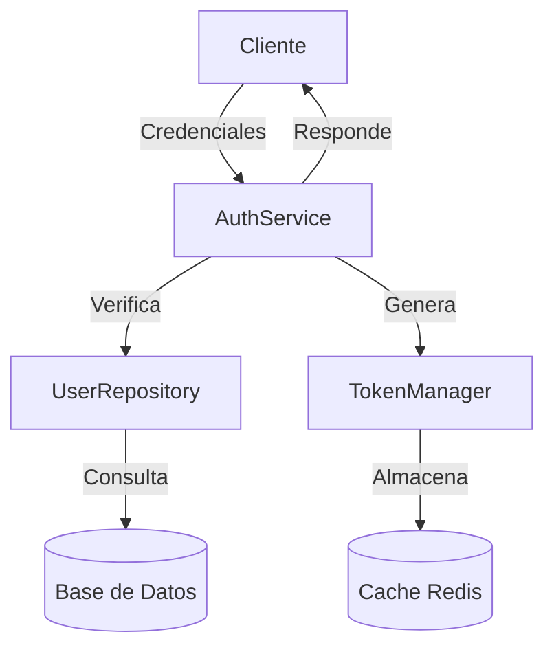

# 6. Documentación para IAs

## 6.1. Documentación desde Cero

La documentación orientada a IAs es fundamentalmente diferente de la documentación tradicional. Su objetivo principal es proporcionar contexto estructurado que permita a los modelos de IA comprender rápidamente la arquitectura, propósito y funcionamiento de un proyecto, maximizando así su capacidad para asistir en el desarrollo.

### Uso del prompt Documentar_proyectos_desde_0

El prompt `Documentar_proyectos_desde_0` está diseñado para crear una documentación completa y estructurada específicamente optimizada para IAs, facilitando su comprensión del proyecto.

#### Proceso de ejecución:

1. **Preparación**:
   - Asegúrate de tener acceso completo al proyecto que deseas documentar
   - Identifica los componentes y módulos principales
   - Determina la arquitectura y patrones utilizados

2. **Ejecución del prompt**:
   - Proporciona el código fuente o acceso al repositorio
   - Define el nivel de detalle deseado
   - Especifica formatos o convenciones particulares si existen

3. **Revisión y refinamiento**:
   - Verifica que la estructura generada sea coherente
   - Asegúrate de que no falten componentes críticos
   - Refina los diagramas y explicaciones según sea necesario

#### Estructura de documentación generada:

El prompt generará una estructura completa en el directorio `/docs` que incluirá:

1. **README.md** (en la raíz)
   - Descripción y propósito del proyecto
   - Tecnologías y versiones utilizadas
   - Dependencias y configuración
   - Estructura de directorios resumida
   - Instrucciones de instalación y ejecución
   - Ejemplos básicos de uso
   - Enlace a la documentación detallada

2. **/docs/**
   - **index.md**: Punto de entrada a la documentación
   - **architecture/**: Documentación arquitectónica
   - **api/**: Documentación de endpoints
   - **guides/**: Guías específicas
   - **modules/**: Documentación por módulo
   - **testing.md**: Información sobre pruebas
   - **SECURITY.md**: Consideraciones de seguridad
   - **GLOSSARY.md**: Terminología del proyecto

3. **Anotaciones en el código** (AI-Hints)
   - En puntos de entrada
   - En lógica compleja
   - En definiciones clave

### Elementos clave para documentación efectiva

Para que la documentación sea verdaderamente útil para las IAs, debe incluir ciertos elementos clave:

#### 1. Estructura jerárquica clara

La documentación debe seguir una estructura que vaya de lo general a lo específico:

```
/docs/
├── index.md                     # Visión general y navegación
├── architecture/
│   ├── ARCHITECTURE.md          # Patrones y decisiones generales
│   └── diagrams/                # Diagramas visuales
│       ├── system-overview.mmd  # Vista general del sistema
│       ├── data-flow.mmd        # Flujo de datos
│       └── component-diagram.mmd # Relaciones entre componentes
├── modules/
│   ├── module-auth.md           # Documentación del módulo de autenticación
│   ├── module-users.md          # Documentación del módulo de usuarios
│   └── ...                      # Otros módulos
└── GLOSSARY.md                  # Terminología específica del proyecto
```

#### 2. Diagramas en formato Mermaid

Los diagramas en Mermaid son particularmente útiles para las IAs, ya que proporcionan representaciones estructuradas que pueden "leer" y comprender:

**Ejemplo de diagrama de arquitectura:**


**Ejemplo de diagrama de secuencia:**


#### 3. Ejemplos concretos de código

Las IAs comprenden mejor con ejemplos concretos que muestren patrones de uso:

```javascript
// Ejemplo de uso del servicio de autenticación
import { AuthService } from './services/auth.service';

// Inicializar el servicio
const authService = AuthService.getInstance();

// Registrar un nuevo usuario
const registerUser = async (userData) => {
  try {
    const result = await authService.registerUser({
      email: userData.email,
      password: userData.password,
      name: userData.name
    });
    return result.user;
  } catch (error) {
    console.error('Error registering user:', error.message);
    throw error;
  }
};

// Autenticar un usuario
const loginUser = async (credentials) => {
  try {
    const { user, token } = await authService.loginUser(
      credentials.email,
      credentials.password
    );
    
    // Almacenar token en localStorage
    localStorage.setItem('auth_token', token);
    
    return user;
  } catch (error) {
    console.error('Login failed:', error.message);
    throw error;
  }
};
```

#### 4. Tablas de referencia

Las tablas proporcionan información estructurada fácil de consultar:

**Ejemplo de tabla de endpoints API:**

| Endpoint | Método | Descripción | Autenticación | Parámetros |
|----------|--------|-------------|---------------|------------|
| `/api/auth/login` | POST | Autenticación de usuario | No | `email`, `password` |
| `/api/auth/register` | POST | Registro de nuevo usuario | No | `email`, `password`, `name` |
| `/api/users/me` | GET | Perfil del usuario actual | Sí | - |
| `/api/projects` | GET | Listar proyectos | Sí | `page`, `limit`, `sort` |
| `/api/projects/:id` | GET | Detalle de proyecto | Sí | `id` (path) |

#### 5. Glosario de términos

Un glosario ayuda a establecer definiciones claras para términos específicos:

```markdown
# Glosario

## Entidades

### Usuario
Persona registrada en el sistema con credenciales de acceso. Puede tener diferentes roles.

### Proyecto
Unidad organizativa principal que contiene tareas y puede tener múltiples miembros.

### Tarea
Unidad de trabajo asignable a un usuario, con estado, prioridad y fecha límite.

## Términos Técnicos

### JWT (JSON Web Token)
Método para transmitir información de identidad de forma segura entre partes como un objeto JSON.

### Middleware
Función que tiene acceso al objeto de solicitud, al objeto de respuesta y a la siguiente función de middleware en el ciclo de solicitud/respuesta.
```

### Enfoque práctico para la documentación

Para crear una documentación efectiva para IAs, sigue estos pasos:

1. **Identifica la estructura del proyecto**:
   - Analiza directorios y archivos clave
   - Determina patrones arquitectónicos
   - Identifica módulos principales

2. **Documenta la arquitectura general**:
   - Crea diagramas de componentes
   - Describe patrones utilizados
   - Explica decisiones arquitectónicas

3. **Documenta cada módulo**:
   - Propósito y responsabilidades
   - Clases/componentes principales
   - Relaciones con otros módulos
   - Ejemplos de uso

4. **Crea referencia de API**:
   - Documenta endpoints
   - Describa formatos de petición/respuesta
   - Incluye ejemplos concretos

5. **Define terminología**:
   - Crea un glosario detallado
   - Define términos del dominio
   - Explica acrónimos y jerga técnica

6. **Añade AI-Hints estratégicos**:
   - En archivos principales
   - En clases/componentes clave
   - En funciones complejas

## 6.2. Actualización de Documentación

Mantener la documentación actualizada es tan importante como crearla inicialmente. El prompt `Actualizar_Doc_Proyectos` está diseñado para facilitar este proceso, permitiendo actualizar la documentación de forma coherente después de cambios en el código.

### Uso del prompt Actualizar_Doc_Proyectos

Este prompt toma un commit específico y actualiza la documentación existente para reflejar los cambios realizados.

#### Proceso de ejecución:

1. **Preparación**:
   - Identifica el commit que incluye los cambios
   - Asegúrate de tener acceso a la documentación existente
   - Determina qué partes de la documentación se verán afectadas

2. **Ejecución del prompt**:
   - Proporciona el mensaje del commit y el ID de tarea
   - Incluye el diff del commit
   - Especifica la estructura de documentación existente

3. **Revisión y aplicación**:
   - Revisa los cambios propuestos a la documentación
   - Aplica las actualizaciones a los archivos correspondientes
   - Verifica que la documentación sea coherente

#### Integración con control de versiones

El proceso de actualización de documentación puede integrarse directamente en el flujo de trabajo de desarrollo:

1. **Durante revisión de código**:
   - Utiliza el prompt para generar las actualizaciones necesarias
   - Revisa los cambios a la documentación junto con el código
   - Incluye los cambios documentales en el mismo PR/MR

2. **Post-commit automatizado**:
   - Configura un hook que ejecute el prompt después de commits
   - Revisa y confirma los cambios a la documentación
   - Mantenimiento continuo con esfuerzo reducido

3. **Ciclo de actualización regular**:
   - Programa actualizaciones periódicas (semanal/quincenal)
   - Procesa múltiples commits en una actualización
   - Refactoriza la documentación cuando sea necesario

### Estrategias para documentación sostenible

Mantener la documentación actualizada requiere estrategias específicas:

1. **Automatización**:
   - Genera documentación de API automáticamente desde el código
   - Utiliza herramientas como JSDoc, Swagger, o TypeDoc
   - Configura CI/CD para validar la documentación

2. **Responsabilidad compartida**:
   - Incluye actualización de documentación en la definición de "terminado"
   - Revisa documentación en code reviews
   - Asigna "dueños" a diferentes secciones de la documentación

3. **Documentación como código**:
   - Mantén la documentación en el mismo repositorio que el código
   - Aplica los mismos estándares de revisión
   - Versiona la documentación junto con el código

4. **Feedback regular**:
   - Pide a la IA que identifique inconsistencias
   - Evalúa regularmente la utilidad de la documentación
   - Refina basado en experiencia real de uso

### Ejemplos de actualización documental

**Ejemplo de cambio en archivo README.md:**

```diff
 ## Características
 
 - Gestión completa de usuarios y autenticación
 - Administración de proyectos y tareas
+- Tableros Kanban para visualización de flujo de trabajo
+- Reportes y estadísticas avanzadas
 - Notificaciones en tiempo real
 - Interfaz responsive
 
 ## Tecnologías
 
 - Frontend: React 17, Redux, Tailwind CSS
 - Backend: Node.js, Express, MongoDB
+- Análisis: TensorFlow.js para recomendaciones inteligentes
 - Despliegue: Docker, GitHub Actions
```

**Ejemplo de actualización de diagrama de arquitectura:**

```diff
 graph TD
     A[Cliente Web] --> B[API Gateway]
     A --> C[Autenticación]
     B --> D[Servicio de Usuarios]
     B --> E[Servicio de Proyectos]
+    B --> H[Servicio de Análisis]
     D --> F[(Base de Datos\nUsuarios)]
     E --> G[(Base de Datos\nProyectos)]
     C --> I[(Cache de\nTokens)]
+    H --> J[(Base de Datos\nAnalíticas)]
+    H --> K[Motor de\nRecomendaciones]
```

**Ejemplo de actualización en documentación de módulo:**

```markdown
# Módulo de Proyectos

## Descripción General
El módulo de Proyectos gestiona la creación, edición y organización de proyectos en el sistema.

## Nuevas Características

### Tableros Kanban
Los proyectos ahora incluyen visualización Kanban para el seguimiento de tareas, permitiendo:
- Visualización de tareas por estado (Pendiente, En progreso, Completada)
- Arrastrar y soltar para cambiar estados
- Filtros y agrupación personalizada

### Integración con Análisis
El módulo ahora se integra con el nuevo Servicio de Análisis para:
- Generar recomendaciones de priorización
- Analizar tendencias de completado
- Predecir cargas de trabajo futuras

## Nuevas Clases/Métodos

### KanbanService
```javascript
// AI-Hint: [KanbanService] [Gestión de visualización y actualización de tableros Kanban] [Conecta con ProjectService y TaskService]
class KanbanService {
  // Métodos principales
  getBoard(projectId);        // Obtiene configuración de tablero para un proyecto
  updateTaskStatus(taskId, newStatus);  // Actualiza estado mediante drag-n-drop
  saveCustomConfiguration(boardConfig); // Guarda configuración personalizada
}
```

### ProjectAnalytics
```javascript
// AI-Hint: [ProjectAnalytics] [Análisis y métricas de proyectos] [Conecta con el servicio de análisis]
class ProjectAnalytics {
  // Métodos principales
  getProjectMetrics(projectId);   // Obtiene métricas básicas
  generateRecommendations(projectId); // Solicita recomendaciones al servicio de análisis
  predictCompletion(projectId);   // Estima fecha de finalización
}
```
```

## 6.3. Equilibrio entre Documentación Humana y para IAs

Aunque la documentación para humanos y para IAs comparte muchos elementos, existen diferencias significativas en enfoque, estructura y contenido que es importante comprender.

### Diferencias clave

| Aspecto | Documentación para Humanos | Documentación para IAs |
|---------|----------------------------|------------------------|
| **Propósito** | Educación, guía, referencia | Proporcionar contexto estructurado |
| **Formato** | Narrativo, instructivo | Estructurado, semántico |
| **Nivel de detalle** | Selectivo, enfocado en lo no obvio | Exhaustivo, incluyendo lo obvio |
| **Organización** | Por caso de uso o tema | Jerárquica, relacional |
| **Ejemplos** | Seleccionados para ilustrar conceptos | Numerosos para establecer patrones |
| **Terminología** | Explicada cuando se introduce | Definida formalmente en glosarios |
| **Diagramas** | Diseñados para comprensión visual | Codificados para interpretación semántica |
| **Metadatos** | Limitados (títulos, índices) | Extensos (relaciones, clasificaciones) |

### Estrategias de coexistencia

Es posible y deseable mantener documentación que sirva tanto a humanos como a IAs:

1. **Documentación en capas**:
   - Capa superficial: Orientada a humanos, narrativa
   - Capa intermedia: Compartida, estructurada pero legible
   - Capa profunda: Metadatos y AI-Hints específicos para IAs

2. **Formato unificado con secciones específicas**:
   - Secciones narrativas para humanos
   - Secciones estructuradas para ambos
   - Secciones técnicas detalladas principalmente para IAs
   - AI-Hints como metadatos invisibles para usuarios normales

3. **Sistema dual complementario**:
   - Documentación principal legible para humanos
   - Archivo `.cursor.json` con metadatos para IAs
   - AI-Hints en código fuente
   - Referencias cruzadas entre ambos sistemas

### Ejemplo de documentación dual-propósito

```markdown
# Servicio de Autenticación

## Descripción General
> [Para humanos]
El Servicio de Autenticación gestiona todos los aspectos de identificación y autorización
de usuarios en el sistema, incluyendo registro, login, gestión de sesiones y permisos.

## Arquitectura
> [Para humanos y IAs]
El servicio sigue el patrón Singleton y actúa como punto centralizado para toda
la lógica relacionada con autenticación.



## Métodos Principales
> [Para humanos y IAs]

| Método | Descripción | Parámetros | Retorno |
|--------|-------------|------------|---------|
| `registerUser` | Registra nuevo usuario | `userData: UserDTO` | `{user: User, token: string}` |
| `loginUser` | Autentica usuario | `email: string, password: string` | `{user: User, token: string}` |
| `verifyToken` | Valida token JWT | `token: string` | `{valid: boolean, payload?: TokenPayload}` |
| `refreshToken` | Renueva token existente | `refreshToken: string` | `{token: string, refreshToken: string}` |

## Ejemplo de Uso
> [Para humanos]

```javascript
// Inicializar el servicio
const authService = AuthService.getInstance();

// Registrar un nuevo usuario
const registerResult = await authService.registerUser({
  email: 'user@example.com',
  password: 'securePassword123',
  name: 'John Doe'
});

console.log(`Usuario creado: ${registerResult.user.id}`);
console.log(`Token: ${registerResult.token}`);
```

## Implementación Técnica
> [Principalmente para IAs]

### Detalles de implementación

El servicio utiliza:
- bcrypt para hash de contraseñas (10 salt rounds)
- jsonwebtoken para generación y verificación de JWT
- Redis para almacenamiento de tokens de refresh
- Winston para logging de eventos de seguridad

### Reglas de negocio

- Contraseñas: mínimo 8 caracteres, al menos 1 número y 1 mayúscula
- Tokens JWT tienen expiración de 1 hora
- Tokens de refresh tienen expiración de 30 días
- Bloqueo de cuenta tras 5 intentos fallidos por 15 minutos
- El email debe ser verificado en 24 horas o la cuenta es desactivada

### Relaciones con otros componentes

- Depende de: UserRepository, TokenManager, Logger
- Utilizado por: AuthController, AuthMiddleware, UserService
```

### Automatización de actualizaciones

Para mantener ambos tipos de documentación sincronizados:

1. **Generación automática**:
   - Scripts que extraen AI-Hints y generan documentación
   - Herramientas que convierten documentación humana a formato IA
   - CI/CD que valida consistencia entre ambos tipos

2. **Plantillas compartidas**:
   - Diseñar plantillas que sirvan a ambos propósitos
   - Incluir secciones obligatorias para diferentes audiencias
   - Validar automáticamente el cumplimiento de la estructura

3. **Workflow integrado**:
   - Incluir actualización de ambos tipos en el mismo proceso
   - Usar prompts específicos para cada actualización
   - Verificar coherencia entre versiones

### Mejores prácticas

1. **Prioriza la estructura**:
   - Para las IAs, la estructura es más importante que el estilo
   - Utiliza formatos consistentes (markdown, yaml, json)
   - Mantén jerarquías claras y relaciones explícitas

2. **Balanza narrativa y datos**:
   - La narrativa ayuda a humanos a entender el contexto
   - Los datos estructurados ayudan a las IAs a procesar información
   - Combina ambos enfoques según la sección

3. **Documenta lo obvio**:
   - Para humanos, lo obvio puede omitirse
   - Para IAs, incluso lo obvio debe documentarse
   - Encuentra un balance que no abrume a los humanos

4. **Mantén referencias cruzadas**:
   - Enlaza documentos relacionados
   - Proporciona índices y tablas de contenido
   - Usa identificadores consistentes para entidades

5. **Actualiza regularmente**:
   - Establece ciclos regulares de revisión
   - Automatiza lo que sea posible
   - Valida la documentación como parte del proceso de CI/CD