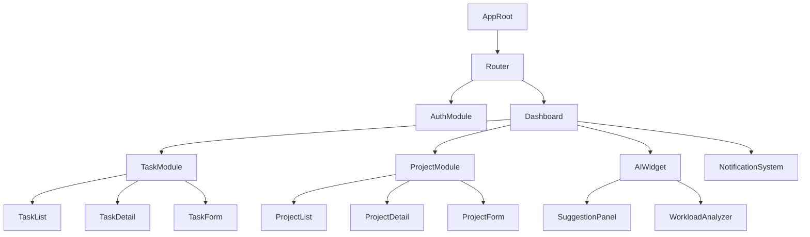
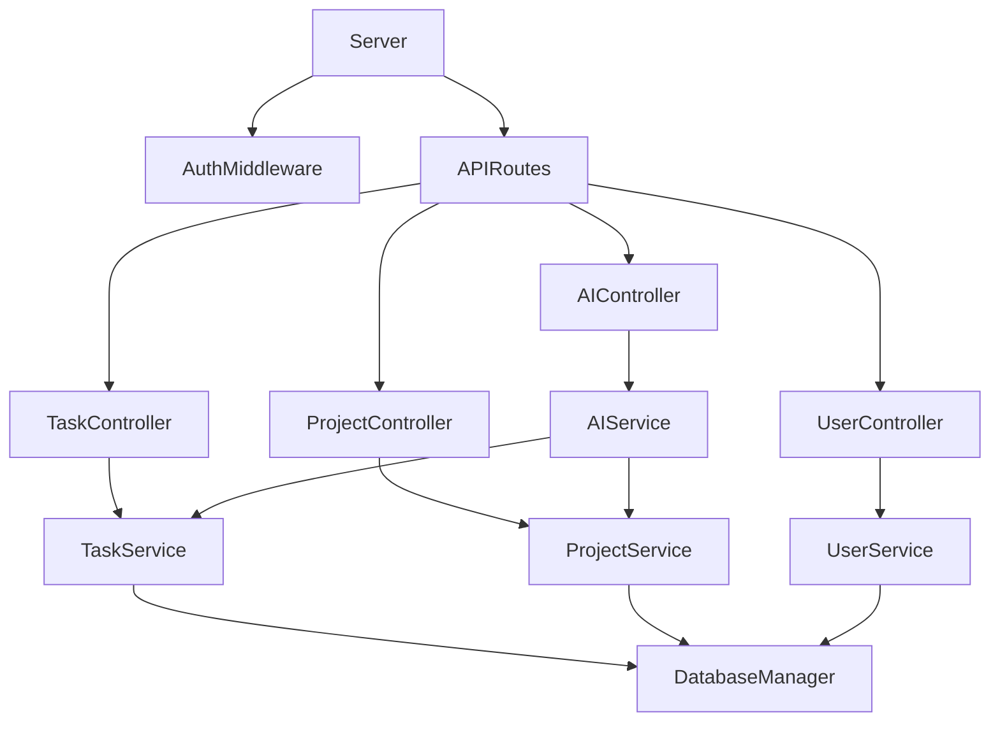
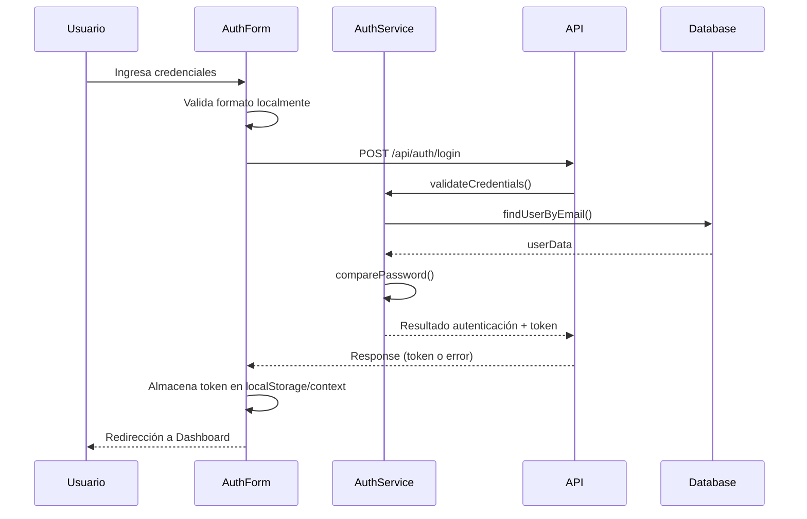
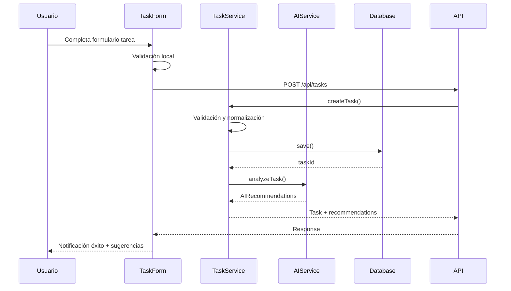
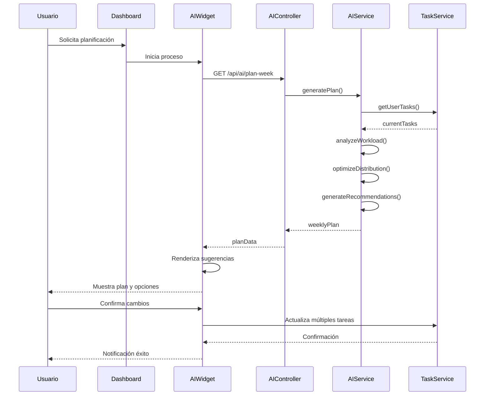

# Plan de Implementación - TaskFlow

## Resumen del Proyecto

TaskFlow es una aplicación de gestión de tareas con capacidades de IA diseñada para ayudar a usuarios individuales y equipos a organizar, priorizar y completar tareas de manera eficiente. La aplicación consta de una interfaz web desarrollada en React y una API RESTful implementada con Node.js. El sistema ofrece funcionalidades como gestión de tareas y proyectos, colaboración en tiempo real, integración con IA para sugerencias y priorización, y una experiencia de usuario intuitiva.

Público objetivo: profesionales, equipos de desarrollo y cualquier persona que necesite un sistema robusto de gestión de tareas con características inteligentes.

Criterios de éxito:
- Interfaz intuitiva con tiempo de respuesta < 1 segundo
- API RESTful completa y bien documentada
- Integración funcional de capacidades de IA
- Cobertura de pruebas > 80%
- Arquitectura escalable y mantenible

## Tecnologías y herramientas

### Frontend
- **Lenguaje**: TypeScript 4.9+
- **Framework**: React 18.2+
- **Routing**: React Router 6.8+
- **Estado global**: Redux Toolkit 1.9+ con RTK Query
- **UI**: Tailwind CSS 3.2+ con HeadlessUI
- **Formularios**: React Hook Form 7.43+ con Zod
- **Testing**: Jest 29+ y React Testing Library
- **Build tool**: Vite 4.1+

### Backend
- **Lenguaje**: TypeScript 4.9+
- **Framework**: Express 4.18+ sobre Node.js 18+
- **Base de datos**: MongoDB 6+ con Mongoose 7+
- **Autenticación**: JWT con Passport.js
- **Validación**: Zod 3.20+
- **Testing**: Jest 29+ y Supertest
- **Servidor web**: Node.js con clustering

### DevOps/Herramientas
- **Control de versiones**: Git con GitHub Flow
- **Linting**: ESLint con configuración específica
- **Formateo**: Prettier
- **CI/CD**: GitHub Actions (opcional)
- **Contenedorización**: Docker y Docker Compose
- **Documentación**: Swagger/OpenAPI para API, JSDoc para código interno

### Justificación de elecciones tecnológicas
- **TypeScript**: Tipado estático para prevenir errores y mejorar la mantenibilidad
- **React**: Biblioteca UI madura con gran ecosistema y rendimiento optimizado
- **Express**: Framework ligero pero potente para APIs con excelente soporte para middleware
- **MongoDB**: Base de datos NoSQL que proporciona flexibilidad para el modelo de datos de tareas
- **Redux Toolkit**: Simplifica la gestión del estado y proporciona RTK Query para peticiones a la API
- **Tailwind CSS**: Facilita el desarrollo rápido de UI con enfoque utility-first

## Principios y convenciones

### Principios de diseño
- **SOLID**: Especialmente Single Responsibility y Dependency Inversion
- **DRY**: Evitar repetición mediante componentes y utilidades reutilizables
- **KISS**: Mantener soluciones simples y directas cuando sea posible
- **Clean Architecture**: Separación clara de responsabilidades en capas

### Estilo de codificación
- **Nomenclatura**:
  - PascalCase para componentes, interfaces y tipos
  - camelCase para variables, funciones y propiedades
  - UPPER_SNAKE_CASE para constantes globales
  ```typescript
  // Ejemplo de componente
  const TaskCard: React.FC<TaskCardProps> = ({ task, onStatusChange }) => { ... }

  // Ejemplo de hook
  function useTaskActions(taskId: string) { ... }

  // Ejemplo de constante
  const MAX_TASKS_PER_PAGE = 20;
  ```

- **Estructura de archivos frontend**:
  ```
  src/
  ├── components/              # Componentes reutilizables
  │   ├── common/              # Componentes genéricos (Button, Input, etc.)
  │   ├── layout/              # Componentes de estructura (Header, Sidebar, etc.)
  │   ├── [feature]/           # Componentes específicos por funcionalidad
  │   └── index.ts             # Exportación centralizada
  ├── hooks/                   # Hooks personalizados
  ├── pages/                   # Componentes a nivel de página
  ├── services/                # Servicios (API, auth, etc.)
  ├── store/                   # Configuración y slices de Redux
  ├── types/                   # Tipos e interfaces TypeScript
  ├── utils/                   # Utilidades
  ├── App.tsx                  # Componente principal
  └── main.tsx                 # Punto de entrada
  ```

- **Estructura de archivos backend**:
  ```
  src/
  ├── api/                     # Definición de rutas y controladores
  │   ├── routes/              # Configuración de rutas
  │   ├── controllers/         # Controladores por recurso
  │   ├── middleware/          # Middleware personalizado
  │   └── validators/          # Esquemas de validación
  ├── config/                  # Configuración de la aplicación
  ├── db/                      # Configuración de base de datos
  │   ├── models/              # Modelos Mongoose
  │   └── index.ts             # Configuración de conexión
  ├── services/                # Lógica de negocio
  ├── ai/                      # Servicios de IA
  ├── types/                   # Tipos e interfaces TypeScript
  ├── utils/                   # Utilidades
  └── server.ts                # Punto de entrada
  ```

### Convenciones de AI-Hints
- Formato estándar: `// AI-Hint: [Propósito] [Contexto] [Reglas/Restricciones]`
- Colocar al inicio de cada archivo importante, clase o función compleja
- Incluir dependencias y restricciones no evidentes

### Reglas de Cursor IDE
Archivo `.cursor.json` en la raíz con:
```json
{
  "project": {
    "name": "TaskFlow",
    "description": "Aplicación de gestión de tareas con IA"
  },
  "context": {
    "entryPoints": [
      "frontend/src/main.tsx",
      "backend/src/server.ts"
    ],
    "criticalPaths": [
      "frontend/src/components",
      "backend/src/api",
      "backend/src/services"
    ],
    "documentation": [
      "docs/api",
      "docs/architecture"
    ]
  },
  "aiHints": {
    "architecture": {
      "frontend": "React SPA with Redux",
      "backend": "Express API with MongoDB",
      "communication": "REST API with JWT auth"
    },
    "conventions": {
      "formatting": "Prettier",
      "naming": "camelCase for variables, PascalCase for components"
    }
  },
  "files": {
    "include": ["**/*.{ts,tsx,js,jsx}"],
    "exclude": ["**/node_modules/**", "**/dist/**", "**/.git/**"]
  }
}
```

## Estructura de carpetas/proyecto

```
taskflow/
├── .cursor.json               # Configuración de Cursor IDE
├── .mcp/                      # Configuración de MCP Servers
├── docs/                      # Documentación
│   ├── api/                   # Documentación de API
│   ├── architecture/          # Diagramas y explicaciones
│   ├── guides/                # Guías de desarrollo
│   └── index.md               # Índice de documentación
├── frontend/                  # Aplicación React
│   ├── public/                # Archivos estáticos
│   ├── src/                   # Código fuente
│   ├── .eslintrc.js           # Configuración de linting
│   ├── package.json           # Dependencias y scripts
│   ├── tsconfig.json          # Configuración TypeScript
│   └── vite.config.ts         # Configuración de Vite
├── backend/                   # API y servicios
│   ├── src/                   # Código fuente
│   ├── tests/                 # Pruebas
│   ├── .eslintrc.js           # Configuración de linting
│   ├── package.json           # Dependencias y scripts
│   └── tsconfig.json          # Configuración TypeScript
├── docker-compose.yml         # Configuración Docker
├── .github/                   # Configuración GitHub Actions
├── .gitignore                 # Configuración Git
└── README.md                  # Documentación general
```

**Propósito de directorios principales**:
- `/docs`: Toda la documentación del proyecto
- `/frontend`: Aplicación React completa (SPA)
- `/backend`: Servidor API RESTful
- `/.mcp`: Configuración para MCP Servers de Cursor IDE
- `/.github`: Flujos de CI/CD automatizados

## Componentes y módulos principales

### Frontend

| Componente | Descripción | Responsabilidades |
|------------|-------------|-------------------|
| **AppRoot** | Punto de entrada | Configuración de rutas, estado global, temas |
| **AuthModule** | Gestión de autenticación | Login, registro, recuperación, permisos |
| **Dashboard** | Vista principal | Layout general, navegación, estado global |
| **TaskModule** | Gestión de tareas | CRUD de tareas, vistas lista/kanban/calendario |
| **ProjectModule** | Gestión de proyectos | CRUD de proyectos, miembros, estadísticas |
| **AIWidget** | Integración con IA | Sugerencias, análisis, priorización |
| **NotificationSystem** | Sistema de notificaciones | Alertas, recordatorios, mensajes |

### Backend

| Componente | Descripción | Responsabilidades |
|------------|-------------|-------------------|
| **Server** | Configuración Express | Middleware, rutas, gestión de errores |
| **AuthService** | Autenticación y autorización | Login, tokens, permisos |
| **TaskService** | Lógica de tareas | CRUD, filtrado, búsqueda |
| **ProjectService** | Lógica de proyectos | CRUD, miembros, permisos |
| **UserService** | Gestión de usuarios | Perfiles, preferencias |
| **AIService** | Integración con IA | Algoritmos de análisis y sugerencias |
| **NotificationService** | Sistema de notificaciones | Generación y envío de notificaciones |
| **DatabaseManager** | Acceso a datos | Conexión, models, queries |

### Diagrama de relaciones de componentes frontend



### Diagrama de relaciones de componentes backend



### AI-Hints principales por módulo

#### Frontend
```typescript
// AI-Hint: [AppRoot] [Punto de entrada de la aplicación] [Configuración de proveedores globales: Auth, Store, Theme, Router]

// AI-Hint: [TaskModule] [Gestión de tareas con CRUD completo] [Incluye vistas: lista, kanban, calendario y filtros avanzados]

// AI-Hint: [AIWidget] [Componente de sugerencias IA] [Recibe datos de tareas actuales y devuelve recomendaciones de priorización y organización]
```

#### Backend
```typescript
// AI-Hint: [Server] [Punto de entrada Express] [Configuración de middleware, rutas, error handling y clustering]

// AI-Hint: [TaskService] [Lógica de negocio para tareas] [Implementa filtrado avanzado, búsqueda, y reglas de negocio]

// AI-Hint: [AIService] [Motor de análisis y sugerencias] [Utiliza algoritmos para priorizar tareas según fecha, importancia y carga]
```

## Diseño de flujos y responsabilidades

### Flujo 1: Autenticación de usuario



**Manejo de errores**:
- Si las credenciales son inválidas: mensaje de error específico
- Si hay problemas de conexión: reintentos y mensaje de error de red
- Si la cuenta está bloqueada: mensaje con instrucciones para desbloquear

### Flujo 2: Creación y gestión de tareas



**Manejo de errores**:
- Validación de campos requeridos y formatos antes de enviar
- Captura de errores de base de datos y devolución de mensajes claros
- Manejo de timeout en servicios de IA con respuesta degradada

### Flujo 3: Análisis y planificación con IA



**Manejo de errores**:
- Si el servicio de IA no responde, ofrecer planificación básica
- Permitir edición manual de la propuesta antes de aplicar
- Validar conflictos antes de aplicar cambios masivos

## Integración con MCP Servers

### Estructura de directorios `.mcp`

```
.mcp/
├── config.json             # Configuración principal
├── README.md               # Instrucciones de uso
├── schemas/                # Esquemas para validación
│   ├── task.schema.json
│   └── project.schema.json
└── resources/
    └── models/
        └── task-analyzer.json
```

### Configuración principal

```json
{
  "version": "1.0",
  "project": {
    "id": "taskflow",
    "description": "Aplicación de gestión de tareas con IA"
  },
  "servers": [
    {
      "id": "ai-service",
      "url": "https://mcp.example.com/ai",
      "auth": {
        "type": "token",
        "envVar": "MCP_AI_TOKEN"
      },
      "resources": [
        {
          "name": "task-analyzer",
          "path": "/models/task-analyzer",
          "description": "Modelo para análisis y sugerencias de tareas"
        },
        {
          "name": "workload-optimizer",
          "path": "/models/workload-optimizer",
          "description": "Modelo para optimizar distribución de tareas"
        }
      ]
    }
  ],
  "settings": {
    "cacheEnabled": true,
    "cacheTTL": 3600,
    "requestTimeout": 5000,
    "maxRetries": 2,
    "logLevel": "info"
  }
}
```

### Estrategias de comunicación

- Uso de client SDK para conexión a MCP servers
- Implementación de caché local para resultados frecuentes
- Fallback a algoritmos locales cuando MCP no esté disponible
- Batching de solicitudes para análisis masivo de tareas

## Plan de fases o sprints

### Fase 1: Fundación (Sprint 1-2)
- Configuración del proyecto (frontend y backend)
- Estructura base de carpetas y archivos
- Configuración de linting, formateo y testing
- Creación de modelos de datos básicos
- Implementación de autenticación

### Fase 2: Core Backend (Sprint 3-4)
- Implementación de API para tareas
- Implementación de API para proyectos
- Implementación de API para usuarios
- Testing de endpoints básicos
- Documentación inicial de API

### Fase 3: Core Frontend (Sprint 5-6)
- Implementación de dashboard básico
- Componentes de gestión de tareas
- Componentes de gestión de proyectos
- Integración con API backend
- Testing de componentes principales

### Fase 4: Funcionalidades IA (Sprint 7-8)
- Implementación de servicios de IA backend
- Integración con MCP servers
- Desarrollo de widgets de IA en frontend
- Testing de funcionalidades de IA
- Refinamiento de algoritmos

### Fase 5: Refinamiento (Sprint 9-10)
- Mejoras de UI/UX
- Optimización de rendimiento
- Implementación de notificaciones
- Testing end-to-end
- Documentación final

## Pruebas y calidad

### Estrategia de testing

1. **Tests unitarios**:
   - Frontend: componentes aislados con React Testing Library
   - Backend: funciones y servicios con Jest
   - Cobertura objetivo: 80%+

2. **Tests de integración**:
   - Frontend: flujos completos de usuario
   - Backend: API endpoints con Supertest
   - Pruebas de integración entre servicios

3. **Tests end-to-end**:
   - Pruebas de escenarios completos con Cypress
   - Enfoque en flujos críticos de usuario

4. **Herramientas**:
   - Jest para runner de tests
   - React Testing Library para componentes
   - Supertest para API testing
   - Cypress para e2e
   - Istanbul para cobertura

5. **CI/CD**:
   - Ejecución de tests en cada PR
   - Análisis de cobertura y calidad
   - Deploy automatizado a entornos de prueba

### Proceso de revisión de código
- Pull requests obligatorios
- Al menos 1 revisor por PR
- Checks automatizados (linting, tipos, tests)
- Criterios definidos de aceptación

## Despliegue y entornos

### Entornos
1. **Desarrollo**:
   - Local para cada desarrollador
   - Base de datos de desarrollo compartida (opcional)
   
2. **Staging**:
   - Réplica cercana a producción
   - Despliegue automático desde main
   - Datos de prueba controlados

3. **Producción**:
   - Entorno optimizado y seguro
   - Despliegue manual o semi-automático
   - Monitorización completa

### Proceso CI/CD
1. **Build**: compilación y empaquetado
2. **Test**: ejecución de tests unitarios y de integración
3. **Análisis**: revisión de calidad de código
4. **Deploy**: despliegue al entorno correspondiente
5. **Verificación**: pruebas post-despliegue

### Infraestructura (con Docker)
- Contenedor para frontend
- Contenedor para backend API
- Contenedor para MongoDB
- Redes Docker para aislamiento
- Volúmenes para persistencia

## Metadatos para IAs

### Formato de AI-Hints

```typescript
// AI-Hint Architecture: [Patrón arquitectónico] [Estructura general] [Principios clave]
// Ejemplo: [MVC modificado] [API REST + SPA] [Separación clara de responsabilidades]

// AI-Hint Component: [Nombre y tipo] [Propósito] [Interacciones principales]
// Ejemplo: [TaskService] [Manejo de lógica de tareas] [Interactúa con DB y AIService]

// AI-Hint Data: [Modelo] [Estructura y validaciones] [Relaciones] 
// Ejemplo: [Task] [Incluye título, descripción, fecha, etc.] [Pertenece a Project, asignado a User]

// AI-Hint Flow: [Nombre del flujo] [Pasos] [Dependencias]
// Ejemplo: [Crear tarea] [ValidarInput→GuardarDB→NotificarUsuarios] [Requiere permisos de proyecto]
```

### Estructura del archivo `.cursor.json`

```json
{
  "project": {
    "name": "TaskFlow",
    "version": "0.1.0",
    "description": "Aplicación de gestión de tareas con IA"
  },
  "context": {
    "entryPoints": {
      "frontend": "frontend/src/main.tsx",
      "backend": "backend/src/server.ts"
    },
    "architecture": {
      "pattern": "Clean Architecture modificada",
      "layers": ["Presentation", "Application", "Domain", "Infrastructure"]
    },
    "documentation": {
      "api": "docs/api/",
      "architecture": "docs/architecture/",
      "guides": "docs/guides/"
    }
  },
  "conventions": {
    "naming": {
      "files": "kebab-case.ts",
      "components": "PascalCase",
      "functions": "camelCase",
      "constants": "UPPER_SNAKE_CASE"
    },
    "structure": {
      "frontend": "Feature-based organization",
      "backend": "Layer-based organization"
    }
  },
  "aiHints": {
    "locations": [
      "At the beginning of key files",
      "Before complex functions/methods",
      "In models and entities"
    ],
    "format": "// AI-Hint Type: [Description 1] [Description 2] [Description 3]"
  }
}
```